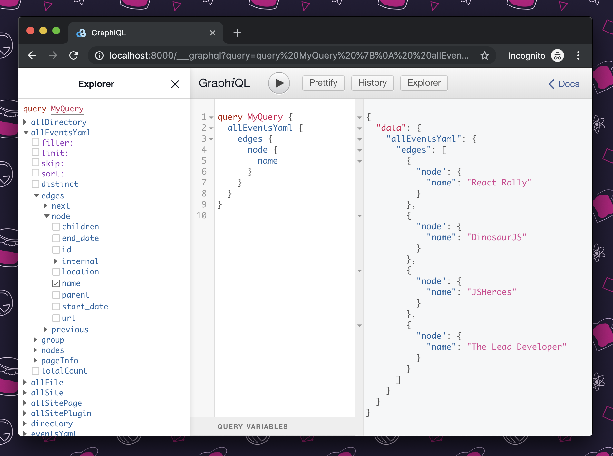
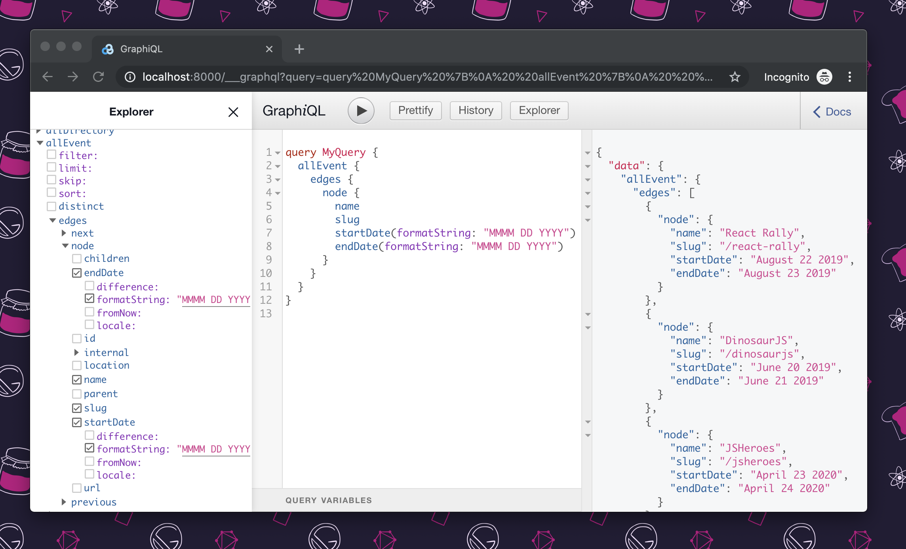
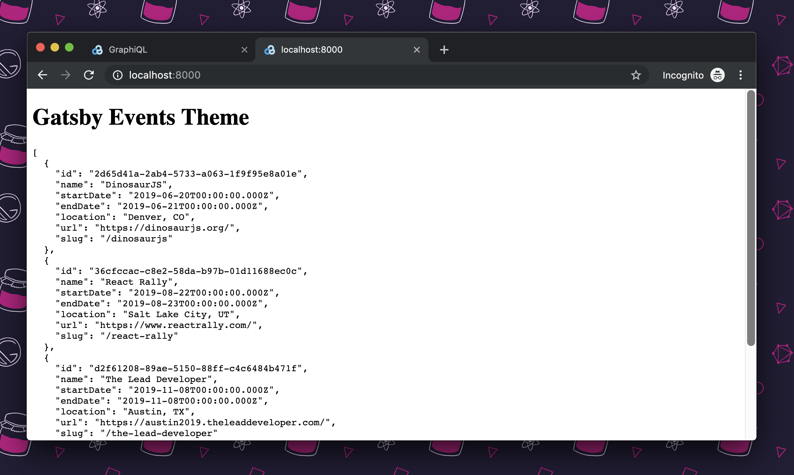
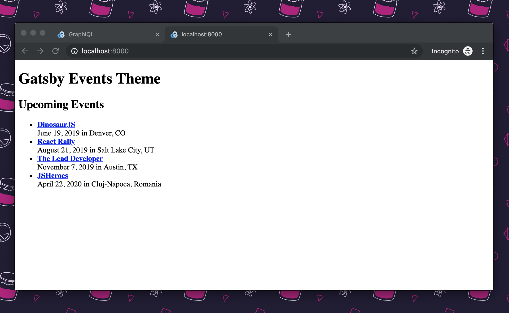

In this tutorial, you'll learn how to build a theme plugin for Gatsby. This tutorial is meant as a written companion to the [Gatsby Theme Authoring Egghead course](https://egghead.io/courses/gatsby-theme-authoring).

## Overview

## Set up yarn workspaces

In this section, you'll learn how to structure folders and configure Yarn workspaces to develop Gatsby themes. You'll create two workspaces, `gatsby-theme-events` and `site`.

You'll see how each workspace can be run separately, as well as one depending on the other. In this example, `gatsby-theme-events` will be a dependency of `site`.

### Create a new empty folder

Title it anything you wish. Through this example, we'll call it `authoring-themes-tutorial`.

### Add a `package.json`

Create a `package.json` file in the new directory, with the following contents:

```json:title=package.json
{
  "private": true,
  "workspaces": ["gatsby-theme-events", "site"]
}
```

### Set up `gatsby-theme-events` and `site`

In the `authoring-themes-tutorial` folder, create two new folders, `gatsby-theme-events`, and `site`.

Create a `package.json` file in each of the new folders. Your file tree will look like this:

```
.
├── gatsby-theme-events
│   └── package.json
├── site
│   └── package.json
└── package.json
```

In the `package.json` file in `gatsby-theme-events`, add the following:

```json:title=gatsby-theme-events/package.json
{
  "name": "gatsby-theme-events",
  "version": "1.0.0",
  "main": "index.js",
  "license": "MIT",
  "scripts": {
    "build": "gatsby build",
    "clean": "gatsby clean",
    "develop": "gatsby develop"
  }
}
```

- The `"name"` corresponds to the yarn workspace you defined earlier, in the root-level `package.json` folder.
- Because we'll be installing `gatsby-theme-events` as a package, we have to specify a `"main"` entry point.
  - This file won't do anything, but it does need to resolve, so create a new file in `gatsby-theme-events` called `index.js`.

```javascript:title=gatsby-theme-events/index.js
// noop
```

Add a small comment to indicate that the file doesn't really do anything, it just needs to exist, and was left blank on purpose.

In the `package.json` file in `site`, add the following:

```json:title=site/package.json
{
  "private": true,
  "name": "site",
  "version": "1.0.0",
  "license": "MIT",
  "scripts": {
    "build": "gatsby build",
    "develop": "gatsby develop",
    "clean": "gatsby clean"
  }
}
```

- `"private"` is set to true, because you won't be publishing the site to npm.
- The `"name"` again corresponds to the yarn workspace you defined earlier, in the root-level `package.json` folder.

### Add dependencies to `site`

Now add `gatsby`, `react`, `react-dom`, and `gatsby-theme-events` as dependencies in `site`:

```shell
yarn workspace site add gatsby react react-dom gatsby-theme-events@*
```

- When you run `yarn workspace site`, it's as if you were running that command while in the `/site` directory. The dependencies will be added to `site`, even though you're not in the `site` directory.
- You're installing `gatsby-theme-events@*`, because you need the workspace to reference the unpublished `gatsby-theme-events` theme.

> 💡 For more detail on using yarn workspaces, you might be interested to check out (@TODO link Jackson's blog post)

You should now see the following dependencies in your `site/package.json`:

```json:title=site/package.json
  {
      "dependencies": {
          "gatsby": "^2.9.11",
          "gatsby-theme-events: "*",
          "react": "^16.8.6",
          "react-dom": "^16.8.6",
      }
  }
```

If you run `yarn workspaces info`, you'll be able to verify that the site is using the `gatsby-theme-events` from the workspace.

[@TODO: screenshot of terminal]

### Add peer dependencies to `gatsby-theme-events`

Targeting the `gatsby-theme-events` workspace, install `gatsby`, `react`, and `react-dom` as peer dependencies:

```shell
yarn workspace gatsby-theme-events add -P gatsby react react-dom
```

### Add development dependencies to `gatsby-theme-events`

During development, you'll use your theme as a regular Gatsby site, so you'll also set `gatsby`, `react`, and `react-dom` as dev dependencies:

```shell
yarn workspace gatsby-theme-events add -D gatsby react react-dom
```

> 💡 The `-P` flag is shorthand for installing peer dependencies, and the `-D` flag is shorthand for installing dev dependencies.

The `gatsby-theme-events/package.json` file should now include the following:

```json:title=gatsby-theme-events/package.json
{
  "peerDependencies": {
    "gatsby": "^2.9.11",
    "react": "^16.8.6",
    "react-dom": "^16.8.6"
  },
  "devDependencies": {
    "gatsby": "^2.9.11",
    "react": "^16.8.6",
    "react-dom": "^16.8.6"
  }
}
```

### Run `site` and `gatsby-theme-events`

Run both `site` and `gatsby-theme-events` to verify that they're working.

```shell
yarn workspace site develop
```

```shell
yarn workspace gatsby-theme-events develop
```

In both cases, you should see a Gatsby site successfully running in development mode. Since there's no content, visiting the site should serve a default Gatsby 404 page.

## Add static data to a theme

In this example, you'll source data from a YAML file into the `gatsby-theme-events` theme.

In the `gatsby-theme-events` directory, create a new `data` directory. Inside that, create a new file, `events.yml`.

Add some sample data:

```yaml:title=gatsby-theme-events/data/events.yml
- name: React Rally
  location: Salt Lake City, UT
  start_date: 2019-08-22
  end_date: 2019-08-23
  url: https://www.reactrally.com/

- name: DinosaurJS
  location: Denver, CO
  start_date: 2019-06-20
  end_date: 2019-06-21
  url: https://dinosaurjs.org/

- name: JSHeroes
  location: Cluj-Napoca, Romania
  start_date: 2020-04-23
  end_date: 2020-04-24
  url: https://jsheroes.io/

- name: The Lead Developer
  location: Austin, TX
  start_date: 2019-11-08
  end_date: 2019-11-08
  url: https://austin2019.theleaddeveloper.com/
```

To read this YAML data, you'll need to install a few more dependencies:

```shell
yarn workspace gatsby-theme-events add gatsby-source-filesystem gatsby-transformer-yaml
```

> 💡 `gatsby-source-filesystem` will let you load the `events.yml` file. `gatsby-transformer-yaml` will let you parse it as YAML data.

Create a `gatsby-config.js` file in the `gatsby-theme-events` directory:

```javascript:title=gatsby-theme-events/config.js
module.exports = {
  plugins: [
    {
      resolve: "gatsby-source-filesystem",
      options: {
        path: "data",
      },
    },
    {
      resolve: "gatsby-transformer-yaml",
      options: {
        typeName: "Event",
      },
    },
  ],
}
```

With this saved, restart the dev server:

```shell
yarn workspace gatsby-theme-events develop
```

Open up the GraphiQL explorer for the site, and make a test query on the "Events" type:

```graphql
query MyQuery {
  allEventsYaml {
    edges {
      node {
        name
      }
    }
  }
}
```

When you execute the query, you should see the GraphQL server successfully return four event names:



## Create a data directory using the `onPreBootstrap` lifecycle

Create a `gatsby-node.js` file in `gatsby-theme-events`.

If we fire up our theme, and the "data" directory doesn't exist, `gatsby-source-filesystem` will throw an error. To guard against this, you'll use the `onPreBootstrap` API hook to check if the data directory exists, and, if not, create it:

```javascript:title=gatsby-theme-events/gatsby-node.js
const fs = require("fs")

// Make sure the data directory exists
exports.onPreBootstrap = ({ reporter }, options) => {
  const contentPath = options.contentPath || "data"

  if (!fs.existsSync(contentPath)) {
    reporter.info(`creating the ${contentPath} directory`)
    fs.mkdirSync(contentPath)
  }
}
```

## Set up to create data-driven pages

To actually create pages, we'll need to:

- Define the "Event" type
- Define resolvers for custom fields on the "Event" type
- Query for events

### Define the "Event" type

```javascript:title=gatsby-theme-events/gatsby-node.js
const fs = require("fs")

// Make sure the data directory exists
exports.onPreBootstrap = ({ reporter }, options) => {
  const contentPath = options.contentPath || "data"

  if (!fs.existsSync(contentPath)) {
    reporter.info(`creating the ${contentPath} directory`)
    fs.mkdirSync(contentPath)
  }
}

// highlight-start
// Define the "Event" type
exports.sourceNodes = ({ actions }) => {
  actions.createTypes(`
    type Event implements Node @dontInfer {
      id: ID!
      name: String!
      location: String!
      startDate: Date! @dateformat @proxy(from: "start_date")
      endDate: Date! @dateformat @proxy(from: "end_date")
      url: String!
      slug: String!
    }
  `)
}
// highlight-end
```

1. You'll use the `createTypes` to create the new "Event" type
2. The "Event" type will implement the typical Gatsby "Node" interface.
3. You'll use `@dontInfer`, because rather than Gatsby inferring fields, you'll be defining them explicitly.
4. In addition to an "id" field, you'll create new fields for each data point associated with an event (name, location, startDate, endDate, url). _To read more detail about creating types, check out the [`createTypes` documentation](g/docs/actions/#createTypes)_.
5. You'll also create a "slug" field. You'll notice our event data doesn't include "slug" data. You'll define this in the next step.

### Define resolvers for any custom fields (slug)

Gatsby gives us a createResolvers API hook. That gives us a function called createResolvers. Inside this function, we are going to set up a base path.

```javascript:title=gatsby-theme-events/gatsby-node.js
const fs = require("fs")

// Make sure the data directory exists
exports.onPreBootstrap = ({ reporter }, options) => {
  const contentPath = options.contentPath || "data"

  if (!fs.existsSync(contentPath)) {
    reporter.info(`creating the ${contentPath} directory`)
    fs.mkdirSync(contentPath)
  }
}

// Define the "Event" type
exports.sourceNodes = ({ actions }) => {
  actions.createTypes(`
    type Event implements Node @dontInfer {
      id: ID!
      name: String!
      location: String!
      startDate: Date! @dateformat @proxy(from: "start_date")
      endDate: Date! @dateformat @proxy(from: "end_date")
      url: String!
      slug: String!
    }
  `)
}

// highlight-start
// Define resolvers for custom fields
exports.createResolvers = ({ createResolvers }, options) => {
  const basePath = options.basePath || "/"

  // Quick-and-dirty helper to convert strings into URL-friendly slugs.
  const slugify = str => {
    const slug = str
      .toLowerCase()
      .replace(/[^a-z0-9]+/g, "-")
      .replace(/(^-|-$)+/g, "")

    return `/${basePath}/${slug}`.replace(/\/\/+/g, "/")
  }

  createResolvers({
    Event: {
      slug: {
        resolve: source => slugify(source.name),
      },
    },
  })
}
// highlight-end
```

Let's take a deeper look at what's happening in this `createResolvers` API hook.

You'll default the `basePath` to the root path (`"/"`):

```javascript:title=gatsby-theme-events/gatsby-node.js
exports.createResolvers = ({ createResolvers }, options) => {
  // highlight-next-line
  const basePath = options.basePath || "/"

  // Quick-and-dirty helper to convert strings into URL-friendly slugs.
  const slugify = str => {
    const slug = str
      .toLowerCase()
      .replace(/[^a-z0-9]+/g, "-")
      .replace(/(^-|-\$)+/g, "")

    return `/${basePath}/${slug}`.replace(/\/\/+/g, "/")
  }

  createResolvers({
    Event: {
      slug: {
        resolve: source => slugify(source.name),
      },
    },
  })
}
```

You'll define helper, `slugify` to help generate the slugs:

```javascript:title=gatsby-theme-events/gatsby-node.js
exports.createResolvers = ({ createResolvers }, options) => {
  const basePath = options.basePath || "/"

  // highlight-start
  // Quick-and-dirty helper to convert strings into URL-friendly slugs.
  const slugify = str => {
    const slug = str
      .toLowerCase()
      .replace(/[^a-z0-9]+/g, "-")
      .replace(/(^-|-\$)+/g, "")

    return `/${basePath}/${slug}`.replace(/\/\/+/g, "/")
  }
  // highlight-end

  createResolvers({
    Event: {
      slug: {
        resolve: source => slugify(source.name),
      },
    },
  })
}
```

Then you'll define a resolver for the `"slug"` field, on the `"Event"` type:

```javascript:title=gatsby-theme-events/gatsby-node.js
exports.createResolvers = ({ createResolvers }, options) => {
  const basePath = options.basePath || "/"

  // Quick-and-dirty helper to convert strings into URL-friendly slugs.
  const slugify = str => {
    const slug = str
      .toLowerCase()
      .replace(/[^a-z0-9]+/g, "-")
      .replace(/(^-|-\$)+/g, "")

    return `/${basePath}/${slug}`.replace(/\/\/+/g, "/")
  }

  // highlight-start
  createResolvers({
    Event: {
      slug: {
        resolve: source => slugify(source.name),
      },
    },
  })
  // highlight-end
}
```

> 💡 The resolver function receives the `source`, which in this case is the `Event` node.

Test that this is working by running `gatsby-theme-events` again:

```shell
yarn workspace gatsby-theme-events develop
```

If you query this time for `allEvents`, you'll see the `Event` data, including the new slugs:



## Create data-driven pages using GraphQL and `createPages`

The last step in `gatsby-node.js` is to create pages for both the event previews, and individual event pages. To do that, you'll use the `createPages` API hook.

> 💡 Note that the previous contents of `gatsby-node.js` are left intact, we'll just omit them from the code snippets in this section, for brevity.

### Set up the call to create the root page

```javascript:title=gatsby-theme-events/gatsby-node.js
// query for events and create pages
// highlight-start
exports.createPages = async ({ actions, graphql, reporter }, options) => {
  const basePath = options.basePath || "/"
  actions.createPage({
    path: basePath,
    component: require.resolve("./src/templates/events.js"),
  })
}
// highlight-end
```

- You'll default the `basePath` to the root path (`"/"`)
- Then you'll set up the call to the `createPage` action to create the a page at the base path.
  - _Note that the component listed doesn't exist yet -- we'll create that shortly._

### Query for events

```javascript:title=gatsby-theme-events/gatsby-node.js
// query for events and create pages
exports.createPages = async ({ actions, graphql, reporter }, options) => {
  const basePath = options.basePath || "/"
  actions.createPage({
    path: basePath,
    component: require.resolve("./src/templates/events.js"),
  })

  // highlight-start
  const result = await graphql(`
    query {
      allEvent(sort: { fields: startDate, order: ASC }) {
        nodes {
          id
          slug
        }
      }
    }
  `)

  if (result.errors) {
    reporter.panic("error loading events", result.errors)
    return
  }
  // highlight-end
}
```

- You'll retrieve all events, sorted by start date, in ascending order.
- You'll handle the error, in case the GraphQL query failed.

### Create a page for each event

```javascript:title=gatsby-theme-events/gatsby-node.js
// query for events and create pages
exports.createPages = async ({ actions, graphql, reporter }, options) => {
  const basePath = options.basePath || "/"
  actions.createPage({
    path: basePath,
    component: require.resolve("./src/templates/events.js"),
  })

  const result = await graphql(`
    query {
      allEvent(sort: { fields: startDate, order: ASC }) {
        nodes {
          id
          slug
        }
      }
    }
  `)

  if (result.errors) {
    reporter.panic("error loading events", result.errors)
    return
  }

  // highlight-start
  const events = result.data.allEvent.nodes

  events.forEach(event => {
    const slug = event.slug

    actions.createPage({
      path: slug,
      component: require.resolve("./src/templates/event.js"),
      context: {
        eventID: event.id,
      },
    })
  })
  // highlight-end
}
```

- You'll grab the event nodes queried from GraphQL.
- You'll loop over all the events that were returned, and use `createPage` to create a page for each event.
  - _Note that we're "wishful programming" again -- `"./src/templates/event.js"` doesn't exist yet._

### Create the "event" and "events" template components.

The last step to make sure that these pages build is to create the page template components.

Create new files for the event template, and the events template:

#### Event template

```javascript:title=gatsby-theme-events/src/templates/events.js
import React from "react"

const EventsTemplate = () => <p>TODO: Build the events page template</p>

export default EventsTemplate
```

#### Events template

```javascript:title=gatsby-theme-events/src/templates/event.js
import React from "react"

const EventTemplate = () => <p>TODO: Build the event page template</p>

export default EventTemplate
```

### Test that pages are building

To test that the root path (`"/"`) and individual event pages are building successfully, run gatsby-theme-events in develop mode again:

```shell
yarn workspace gatsby-theme-events develop
```

You should see the placeholder `events.js` component at [localhost:8000](http://localhost:8000/).

If you hit [http://localhost:8000/404](http://localhost:8000/404) (for example -- or any route that doesn't exist) you should see a listing of event pages, all building with the placeholder `event.js` component.

## Display sorted data with `useStaticQuery`

To show event data, you'll import `graphql` and `useStaticQuery` from Gatsby in the events.js component.

```javascript:title=gatsby-theme-events/src/templates/events.js
import React from "react"
// highlight-next-line
import { graphql, useStaticQuery } from "gatsby"

const EventsTemplate = () => <p>TODO: Build the events page template</p>

export default EventsTemplate
```

Refactor the `EventsTemplate` component to include a static query for events data:

```javascript:title=gatsby-theme-events/src/templates/events.js
import React from "react"
import { graphql, useStaticQuery } from "gatsby"

// highlight-start
const EventsTemplate = () => {
  const data = useStaticQuery(graphql`
    query {
      allEvent(sort: { fields: startDate, order: ASC }) {
        nodes {
          id
          name
          startDate
          endDate
          location
          url
          slug
        }
      }
    }
  `)

  const events = data.allEvent.nodes

  return <p>TODO: Build the events page template</p>
}
// highlight-end

export default EventsTemplate
```

### Create the UI to display event data

Start creating the UI to display the event data.

#### Create a general layout component

Create a new file at `gatsby-theme-events/src/components/layout.js`:

```javascript:title=gatsby-theme-events/src/components/layout.js
import React from "react"

const Layout = ({ children }) => (
  <div>
    <h1>Gatsby Events Theme</h1>
    {children}
  </div>
)

export default Layout
```

#### Create an events list component

Create a new file at `gatsby-theme-events/src/components/event-list.js`:

```javascript:title=gatsby-theme-events/src/components/event-list.js
import React from "react"

const EventList = ({ events }) => <pre>{JSON.stringify(events, null, 2)}</pre>

export default EventList
```

For now, this component will just return whatever data you send it on the `events` prop.

### Add the layout and events list components to the events page

```javascript:title=gatsby-theme-events/src/templates/events.js
import React from "react"
import { graphql, useStaticQuery } from "gatsby"
// highlight-start
import Layout from "../components/layout"
import EventList from "../components/event-list"
// highlight-end

const EventsTemplate = () => {
  const data = useStaticQuery(graphql`
    query {
      allEvent(sort: { fields: startDate, order: ASC }) {
        nodes {
          id
          name
          startDate
          endDate
          location
          url
          slug
        }
      }
    }
  `)

  const events = data.allEvent.nodes

  // highlight-start
  return (
    <Layout>
      <EventList events={events} />
    </Layout>
  )
  // highlight-end
}

export default EventsTemplate
```

- Import the two new components.
- Refactor the render method to use the new components, and give the `<EventList>` component the events data.

To test that it's working, open up [localhost:8000](http://localhost:8000/) again. You should see the "Gatsby Events Theme" header from `<Layout>` component, and the stringified event data from the `<EventList>` component.



### Update the event list component

Update the event list component to use the `event` data in markup, rather than displaying the raw data:

```jsx:title=gatsby-theme-events/src/components/event-list.js
import React from "react"
// highlight-start
import { Link } from "gatsby"

const EventList = ({ events }) => (
  <>
    <h2>Upcoming Events</h2>
    <ul>
      {events.map(event => (
        <li key={event.id}>
          <strong>
            <Link to={event.slug}>{event.name}</Link>
          </strong>
          <br />
          {new Date(event.startDate).toLocaleDateString("en-US", {
            month: "long",
            day: "numeric",
            year: "numeric",
          })}{" "}
          in {event.location}
        </li>
      ))}
    </ul>
  </>
)
// highlight-end

export default EventList
```

- You've created a header for "Upcoming Events"
- You've mapped over all of the "event" records, displaying:
  - The event name (which links to the event page)
  - The date of the event
  - The location of the event

Checking [localhost:8000](http://localhost:8000/) again, you should see the new markup:



## Display and query data by id with context and static queries

Similar to EventList, you'll need to create a React component template for an individual Event page.

### Add a page query

First, you'll create a page query to query for individual events by id.

```javascript:title=gatsby-theme-events/src/templates/event.js
import React from "react"
// highlight-start
import { graphql } from "gatsby"

export const query = graphql`
  query($eventID: String!) {
    event(id: { eq: $eventID }) {
      name
      url
      startDate(formatString: "MMMM DD YYYY")
      endDate(formatString: "MMMM DD YYYY")
      location
      slug
    }
  }
`
// highlight-end

const EventTemplate = () => <p>TODO: Build the event page template</p>

export default EventTemplate
```

### Modify the event template to access event data

```javascript:title=gatsby-theme-events/src/templates/events.js
import React from "react"
import { graphql } from "gatsby"
// highlight-next-line
import Layout from "../components/layout"

export const query = graphql`
  query($eventID: String!) {
    event(id: { eq: $eventID }) {
      name
      url
      startDate(formatString: "MMMM DD YYYY")
      endDate(formatString: "MMMM DD YYYY")
      location
      slug
    }
  }
`
// highlight-start
const EventTemplate = ({ data: { event } }) => (
  <Layout>
    <Event {...event} />
  </Layout>
)
// highlight-end

export default EventTemplate
```

We're wishful programming here again -- the `<Event>` component doesn't exist yet. Create that component in `gatsby-theme-events/src/components/event.js`:

## Style and format dates in React

## Configure a theme to take options

## Make themes extendable with gatsby-theme-ui

## Use and override a theme using component shadowing

## Publish a theme to npm

## Consume a theme in a Gatsby application

## Use component shadowing to override theme components
